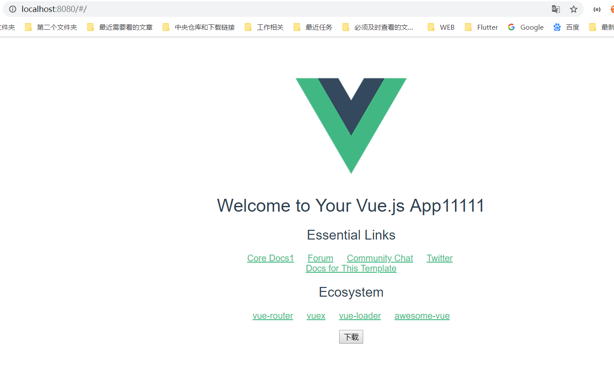

# firstvue


> 如何使用

1.构建自己的项目

vue init webpack firstVue

用vue-cli构建项目 firstVue。解释一下这个命令，这个命令的意思是初始化一个项目，其中webpack是构建工具，也就是整个项目是基于webpack的。其中firstVue是整个项目文件夹的名称，这个文件夹会自动生成在你指定的目录中

2.安装项目所需的依赖

要安装依赖包，首先cd到项目文件夹（firstVue文件夹），然后运行命令 cnpm install ，等待安装

3.把生成的src目录整体替换成本项目的src文件夹即可

4.运行项目   npm run dev

在项目目录中，运行命令 npm run dev ，会用热加载的方式运行我们的应用，热加载可以让我们在修改完代码后不用手动刷新浏览器就能实时看到修改后的效果。（修改完代码，保存，页面直接刷新到最新内容）


> 第一个vue项目

## Build Setup

``` bash
# install dependencies
npm install

# serve with hot reload at localhost:8080
npm run dev

# build for production with minification
npm run build

# build for production and view the bundle analyzer report
npm run build --report

# run unit tests
npm run unit

# run e2e tests
npm run e2e

# run all tests
npm test
```

For a detailed explanation on how things work, check out the [guide](http://vuejs-templates.github.io/webpack/) and [docs for vue-loader](http://vuejs.github.io/vue-loader).
